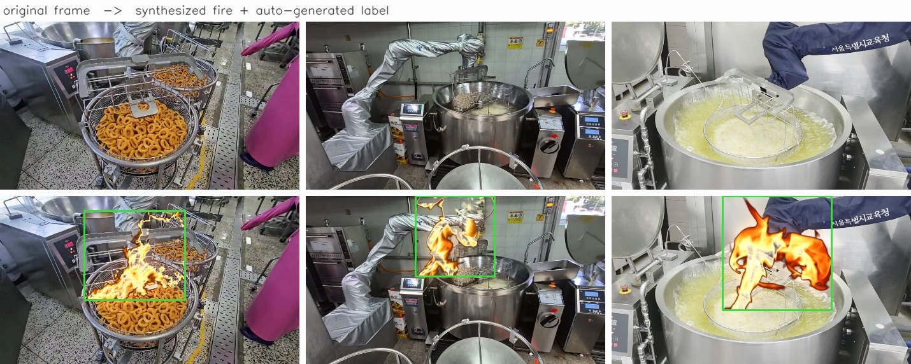
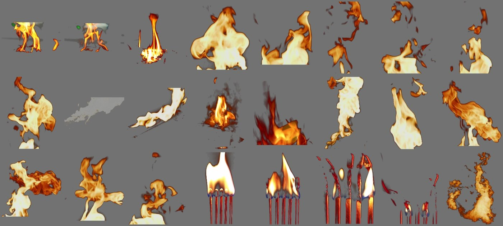
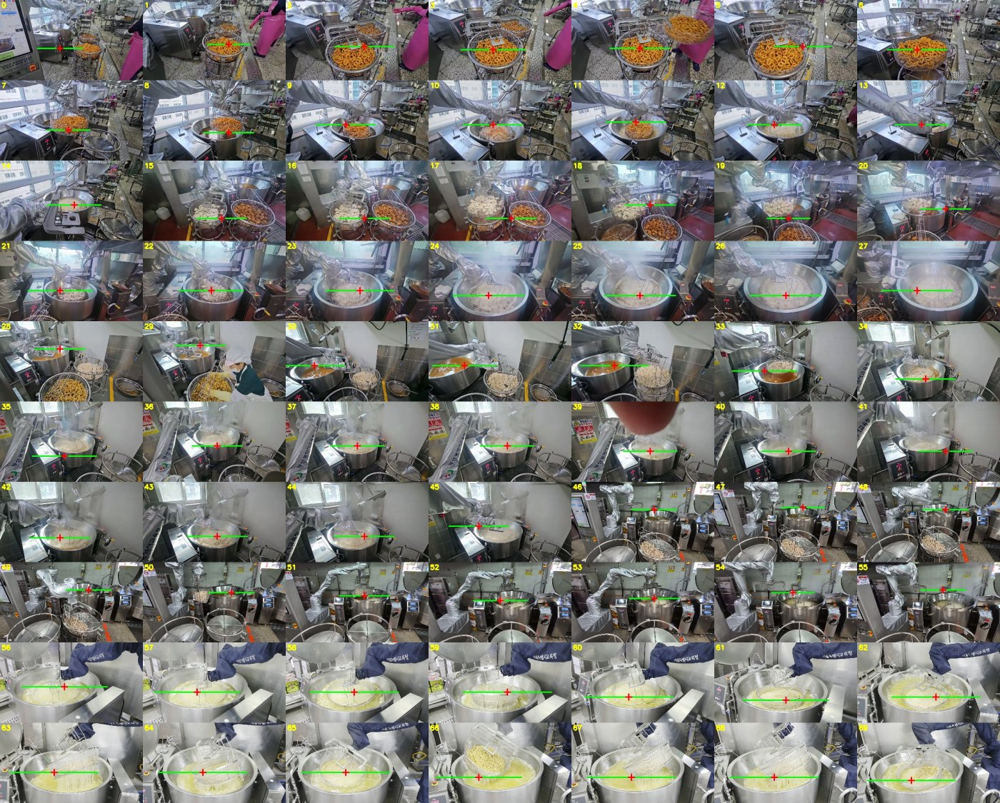

# 조리로봇 화재 인식 — 실사 합성 학습 PoC

급식실 튀김 조리 로봇이 화재를 인식하기 위한 탐지 모델을, **실제 화재 이미지를 한 장도 쓰지 않고** 학습시켰습니다.
실제 급식실 조리 영상 프레임에 실제 화염 영상을 합성해 학습 데이터를 만들고, 공개 실화재 데이터셋(D-Fire)으로 검증했습니다.

급식실에서 실제로 불을 낼 수는 없습니다. 자율주행의 코너케이스와 같은 문제이고, 그래서 합성으로 학습했습니다.



*윗줄이 실제 급식실 프레임, 아랫줄이 화염을 합성한 학습 데이터입니다. 초록 박스는 사람이 그린 것이 아니라 합성 좌표에서 자동 생성된 YOLO 라벨입니다.*

---

## 입력과 출력

**입력** — 실제 급식실 CCTV/촬영 프레임 1장 (1920×1080 또는 960×540, JPEG)

**출력** — 화재 바운딩박스와 신뢰도

```
[{"class": "fire", "conf": 0.41, "bbox": [612, 338, 799, 585]}]
```

**학습 데이터 생성 과정**

```
실제 급식실 프레임 (튀김기·기름 표면 위치를 수작업 지정)
        +
실제 화염 영상에서 추출한 알파 채널 화염 (390종)
        ↓  합성 + 아티팩트 무작위화
합성 화재 이미지 + YOLO 라벨 (자동 생성, 수작업 라벨링 0건)
```

---

## 결과 (한눈에)

5회에 걸쳐 학습 데이터 구성만 바꿔가며 재학습했습니다. 모델·에폭·입력 크기는 전 회차 동일(YOLOv8s / 60 epoch / 640px / T4).

| 회차 | 학습 데이터 변경점 | A 실화재 recall | B 주방 오탐률 | C 배경 오탐률 | 판별비 A/B |
|---|---|---|---|---|---|
| 1 | positive 910 / negative 70 | 60.7% | 88.0% | 5.3% | 0.69 |
| 2 | negative 1,031 (주황 물체 크롭 추가) | 12.7% | 49.3% | 4.0% | 0.26 |
| 3 | negative 236 (주방 5곳→8곳, 크롭 제거) | 24.0% | 28.0% | 2.7% | 0.86 |
| 4 | + 주방 밖 배경 600쌍 추가 | 24.0% | 9.3% | 1.3% | 2.58 |
| **5** | **+ positive 의 50%에 대기 산란** | **22.7%** | **1.3%** | **1.3%** | **17.5** |

*conf 0.25 기준. A·B·C는 모두 합성 이미지가 아닌 실제 사진으로만 측정.*

**배치 환경 오탐률 88.0% → 1.3% (-86.7%p), 판별비 0.69 → 17.5 (25배)**


오탐만 줄이는 것은 모델을 조용하게 만들면 되므로 그 자체로는 성과가 아닙니다. 2회차가 정확히 그 함정에 빠졌습니다 — 오탐이 88%에서 49%로 내려갔지만 인식률이 60.7%에서 12.7%로 붕괴해 판별비는 오히려 나빠졌습니다. 그래서 두 지표를 항상 함께 봅니다.

### 같은 인식률에서의 오탐 비교

신뢰도 기준선을 바꾸면 인식률과 오탐률이 함께 움직이므로, 한 지점의 수치만으로는 모델을 비교할 수 없습니다. 아래는 기준선을 훑으며 두 지표를 함께 그린 것으로, **왼쪽 위에 있을수록 좋은 모델**입니다.


4회차는 오탐 9.3%에서 인식률 24.0%였습니다. 5회차는 **오탐이 더 낮은 6.7%에서 인식률 42.0%** 로, 같은 조건에서 1.75배를 잡습니다.

### 신뢰도 기준선별 성능 (5회차)


| conf | A 실화재 | B 주방 오탐 | C 배경 오탐 |
|---|---|---|---|
| 0.03 | 42.0% | 6.7% | 5.3% |
| 0.05 | 42.0% | 6.7% | 5.3% |
| **0.10** | **36.0%** | **2.7%** | **4.0%** |
| 0.15 | 30.0% | 2.7% | 2.7% |
| 0.20 | 26.7% | 2.7% | 1.3% |
| 0.25 | 22.7% | 1.3% | 1.3% |

운용 기준선은 **0.10** 으로 확정했습니다. B가 0.10~0.20 구간에서 2.7%로 평평하므로, 그 구간의 시작점이 오탐 최소 상태에서 인식률이 가장 높은 지점입니다. 인식률을 우선한다면 0.05(A 42.0% / B 6.7%)도 선택지입니다.

### 평가 설계

세 그룹을 분리해 측정한 이유는 실패 원인을 구분하기 위해서입니다.

| 그룹 | 구성 | 답하는 질문 |
|---|---|---|
| **A** | D-Fire 실화재 150장 | 합성 학습이 실사에 전이되는가 |
| **B** | 개원중 CCTV 정상 조리 75장 (학습 미사용) | 실제 배치 환경에서 오작동하지 않는가 |
| **C** | D-Fire 배경 75장 (화재 없음) | 화재를 배웠는가, 데이터셋 도메인을 외웠는가 |

A가 낮고 C도 낮으면 전이 실패, A가 낮은데 C가 높으면 도메인 암기, B가 높으면 조리 중 오작동입니다.
5회차의 C 1.3%는 모델이 도메인이 아니라 화재에 반응하고 있음을 뒷받침합니다.

### 재료



*스톡 화염 영상 11개에서 610프레임을 뽑아 휘도 키잉으로 알파를 추출하고, 채도 게이트로 연기·과노출 덩어리를 걸러낸 뒤 지각해시로 중복을 제거해 남은 390종. 촛불 영상 등 2개는 전량 제외했습니다.*



*베이스 70장에 수작업으로 지정한 앵커. 빨간 십자가 불꽃 밑동(기름·음식 표면), 초록 선이 조리기구 폭입니다. 이 폭을 기준으로 화염 크기를 산출해 냄비 크기에 비례한 불이 나오게 했습니다.*

---

## 회차별로 무엇을 알아냈나

**1회차** — 합성 학습이 실사에 전이된다는 것을 확인(A 60.7%, C 5.3%). 동시에 정상 조리 화면의 88%에서 오탐이 발생해 배치 불가.
오탐 위치를 시각화한 결과 기름이나 튀긴 음식이 아니라 **장비의 주황색 손잡이와 제어판 표시등**을 화재로 오인하고 있었습니다. 학습 negative가 급식실 5곳 70장뿐이라, 개원중 주방의 해당 물체를 한 번도 본 적이 없었습니다.

**2회차** — 주황색 물체를 잘라내 hard negative로 명시 학습. **실패.** A가 12.7%로 붕괴했고 B는 49.3%에 머물렀습니다. 확대한 주황색 크롭을 "불 아님"으로 가르치면서 흐릿한 실제 화염까지 함께 억눌렸습니다. 한 회차에 다섯 가지를 동시에 바꿔 원인 특정도 불가능했습니다.

**3회차** — 1회차 설정으로 되돌리고 **negative만 70→236장(급식실 5곳→8곳)** 으로 변경. B가 88%→28%로 하락. 변수를 하나만 바꿔 **negative 다양성이 오탐을 지배한다**는 것이 특정됐습니다.

**4회차** — 주방 밖 배경 600장에도 동일 화염을 합성하고, 같은 배경의 "불 없음" 짝을 negative로 함께 투입. B가 28%→9.3%로 추가 하락. A 천장은 46.7%→44.0%로 변동 없어, **배경 다양성이 A를 올린다는 가설은 기각**되었습니다.

**5회차** — positive 의 절반에 대기 산란(채도 저하 + 흰 베일 + 투과 + 블러)을 적용. 평가셋의 실화재가 연기에 섞이거나 대낮에 흐려진 화염이라는 관찰에서 나온 조치입니다.
**A 천장 가설은 다시 기각** — 44.0%→42.0%로 사실상 변동 없었습니다. 흐릿함을 후처리로 흉내내도 못 잡던 화재는 여전히 못 잡습니다.
**대신 B가 무너졌습니다** — 29.3%→6.7%(conf 0.03 기준). 채도가 낮은 화염을 학습하면서 모델이 "채도 높은 주황색"이라는 얕은 단서를 쓸 수 없게 되었고, 불꽃의 구조와 질감으로 판단하게 되면서 균일한 주황색 물체에 더 이상 반응하지 않는 것으로 해석됩니다. 의도한 목표(A)는 빗나갔지만 다섯 회차 중 판별력이 가장 크게 개선된 변경이었습니다.

---

## 진행 상황

- [x] 급식실 조리 영상 수집 (8개 사업장, 11개 영상)
- [x] 프레임 추출·중복 제거 (지각해시) → 고유 프레임 236장
- [x] 화염 소재 추출 (휘도 키잉 + 채도 게이트 + 중복 제거) → 390종
- [x] 베이스 프레임 70장에 조리기구 앵커 수작업 지정
- [x] 합성 파이프라인 (배치·발광·센서 특성 정합·라벨 자동 생성)
- [x] 아티팩트 무작위화 (알파 곡선·경계 블러·색온도·노이즈·JPEG 재압축)
- [x] D-Fire 필터링 및 3그룹 평가셋 구성
- [x] 5회차 통제 실험 → 운용 기준선(conf 0.10) 및 최종 가중치 확정
- [ ] 주방 화재 전용 평가셋 확보 (Roboflow KitchenFire 등)
- [ ] 웹3D 렌더링 화면에서의 인식 검증
- [ ] 탐지 결과 JSON 규격화 → VLM 행동 선택 → 안전 규칙 검사

---

## 빠른 재현

Colab에서 GPU(T4) 런타임으로 실행합니다.

**`notebooks/gate.ipynb` 를 Colab에서 열고 위에서부터 실행**하면 전체가 재현됩니다(T4 기준 약 1시간).
저장소 압축본과 `assets_1~3.zip` 을 첫 셀에서 업로드하고, D-Fire 다운로드에 Kaggle 계정이 필요합니다.

명령줄로 직접 돌릴 경우:

```bash
pip install ultralytics kagglehub

# 1. D-Fire 를 걸러 평가셋 A(150장)·C(75장)와 학습용 배경 목록을 만든다
python scripts/dfire_eval_set.py --dfire /path/to/d-fire --out eval

# 2. 합성 학습셋 생성 (positive 1,510 / negative 836, 라벨 자동 생성)
python scripts/synthesize.py --assets assets --out ds \
    --dfire-bg-list eval/train_bg.txt --dfire-bg-count 600 --haze-prob 0.5

# 3. 학습
yolo detect train model=yolov8s.pt data=ds/data.yaml epochs=60 imgsz=640 batch=16

# 4. 채점 (A/B/C 3그룹 + 기준선 곡선 + 판정)
python scripts/eval_gate.py --weights runs/detect/train/weights/best.pt \
    --eval-dir eval --cctv assets/eval_neg --conf 0.10
```

소요 시간은 데이터 생성 3분, 학습 50분, 채점 1분입니다.
**학습 없이 결과만 확인하려면** 3단계를 건너뛰고 4단계에서
`--weights assets/weights/round5_best.pt` 를 지정하면 됩니다.

회차별 구성은 인자로 재현됩니다.
`--haze-prob 0` = 4회차, `--dfire-bg-list` 까지 빼면 = 3회차.

---

## 폴더 구조

```
kitchen-fire-poc/
├── README.md
├── docs/                    문서용 이미지
├── scripts/
│   ├── dfire_eval_set.py    D-Fire 필터링 -> 평가셋 A·C + 학습용 배경 목록
│   ├── synthesize.py        합성 + YOLO 라벨 자동 생성
│   └── eval_gate.py         A/B/C 채점 + 기준선 곡선 + 판정
├── notebooks/
│   └── gate.ipynb           Colab 전체 절차
└── assets/
    ├── weights/
    │   └── round5_best.pt   최종 모델 (YOLOv8s, 22.5MB) — 학습 없이 채점만 재현 가능
    ├── bases/               합성 베이스 70장 (조리기구 앵커 지정 대상)
    ├── anchors.json         베이스별 (불꽃 밑동 x, y, 조리기구 폭)
    ├── flamelib/            알파 포함 화염 390종 (webp)
    ├── negsrc/              주방 원본 프레임 236장 (negative)
    └── eval_neg/            개원중 CCTV 75장 (평가 B, 학습 미사용)
```

`assets/` 는 용량 때문에 `assets_1~3.zip` 으로 나뉘어 배포됩니다. 세 개를 모두 저장소 루트에 풀면 위 구조가 됩니다.

---

## 데이터 규모

| 구분 | 출처 | 수량 | 용도 |
|---|---|---|---|
| 급식실 조리 프레임 | 8개 사업장 11개 영상 | 236장 (고유) | 합성 베이스 / negative |
| └ 앵커 지정 베이스 | 위 중 선별 | 70장 | 화염 합성 대상 |
| 화염 소재 | 스톡 영상 11개 | 390종 (알파 포함) | 합성 재료 |
| 주방 밖 배경 | D-Fire 배경 | 600장 | 배경 다양성 (4회차~) |
| **학습 positive** | 합성 | **1,510장** | 라벨 자동 생성 |
| **학습 negative** | 원본 | **836장** | 빈 라벨 |
| 평가 A | D-Fire 화재 | 150장 | 실사 전이 측정 |
| 평가 B | 개원중 CCTV | 75장 | 배치 환경 오탐 |
| 평가 C | D-Fire 배경 | 75장 | 도메인 암기 진단 |

수작업 바운딩박스 라벨링: **0건.** 합성 시 화염을 붙인 좌표를 알고 있으므로 라벨이 자동으로 생성됩니다. 1,510장 전수 검증에서 이상 라벨 0건.

---

## 원칙

**평가에 합성 이미지를 쓰지 않습니다.** A·B·C 세 그룹 모두 실제 사진입니다. 합성으로 학습해 합성으로 평가하면 아무것도 증명되지 않습니다.

**학습과 평가는 영상 단위로 분리합니다.** 개원중 CCTV는 학습에 단 한 프레임도 사용하지 않았습니다. 연속 프레임은 배경이 거의 같으므로 프레임 단위 분리로는 누수를 막을 수 없습니다.

**판정 기준을 결과보다 먼저 확정합니다.** "recall 50% 이상 확장 / 20~50% 보강 / 20% 미만 중단, B 15% 초과 시 recall 무관하게 보강"을 1회차 실행 전에 코드에 명시했고 이후 수정하지 않았습니다.

**한 회차에 한 변수만 바꿉니다.** 2회차에서 다섯 가지를 동시에 바꿔 원인 특정에 실패한 뒤 도입한 원칙입니다. 3·4·5회차는 이 원칙으로 각각 하나의 결론을 얻었습니다.

**합성 아티팩트는 제거하지 않고 무작위화합니다.** 이미지마다 경계 강도·색온도·노이즈·압축률을 다르게 주어, 합성 흔적이 일관된 단서가 되지 못하게 합니다. 사실성을 높이는 것보다 이쪽이 전이에 유효합니다.

---

## 한계

**평가 A는 주방 화재가 아닙니다.** D-Fire에 실내 근접 화재가 거의 없어, 필터링 후에도 산불·차량화재·야외 화재가 대부분입니다. 따라서 A 42%는 "주방 화재를 44% 잡는다"가 아니라 **"도메인이 다른 일반 실화재를 42% 잡는다"** 입니다. 원래 의도보다 어려운 시험이지만, 배치 환경 성능을 직접 말해주지는 않습니다.

**A 42~44%는 현재 화염 소재의 천장입니다.** 3·4·5회차에서 동일하게 나타났고 기준선을 0.03까지 낮춰도 오르지 않습니다. 5회차에서 대기 산란으로 흐릿한 화염을 흉내내 직접 시험했지만 천장은 움직이지 않았습니다. 미탐지 56%는 신뢰도가 낮은 것이 아니라 반응이 전혀 없습니다. 평가셋의 실화재가 연기에 섞이거나 대낮에 흐려진 화염인 반면, 학습에 쓴 소재는 전부 검은 배경에서 촬영된 선명한 스톡 화염이기 때문으로 추정됩니다. 데이터셋 구성 조정으로는 넘을 수 없고, 소재 종류를 바꿔야 합니다.

**B의 실효 표본 수는 75보다 작습니다.** 고정 CCTV라 145프레임 중 시각적으로 구별되는 장면이 12개뿐입니다. 2.7%는 75장 중 2장이라는 뜻이고, 신뢰구간은 표본 수가 시사하는 것보다 훨씬 넓습니다. 회차 간 방향성(29.3%→6.7%)은 곡선 전 구간에서 일관되므로 신뢰할 수 있지만, 절대값을 정밀한 성능 수치로 인용해서는 안 됩니다.

**처음 보는 주방으로의 일반화는 미검증입니다.** 개원중 한 곳에서만 측정했습니다. 실제 배치에서는 현장 영상으로 보정하는 것이 표준이므로, "무보정 오탐률"과 "현장 보정 후 오탐률"을 나누어 보고하는 것이 정확합니다.

**정지 이미지 기준입니다.** 실시간 영상에서의 동작, 프레임 간 일관성, 추론 지연은 측정하지 않았습니다.

이 작업은 **타당성 검증(PoC)** 이며 제품 검증이 아닙니다.
