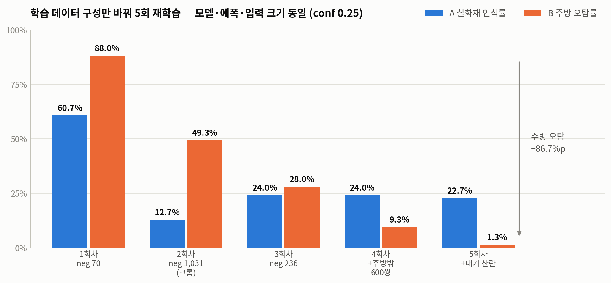
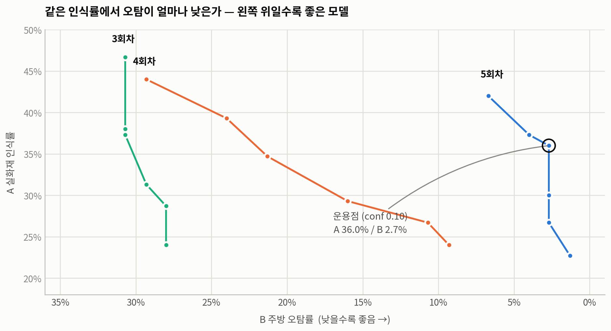
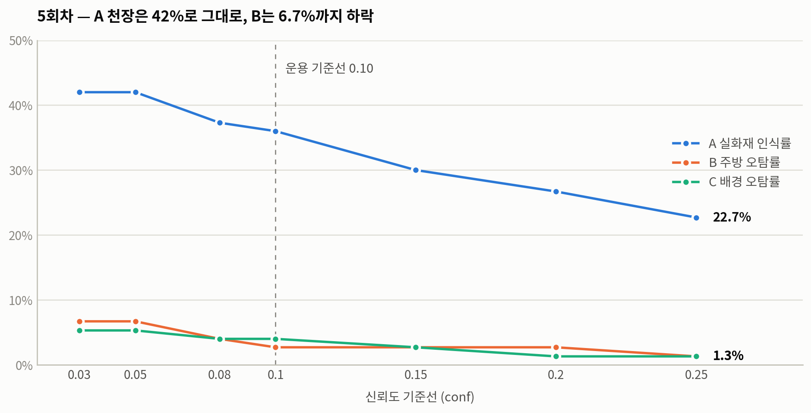
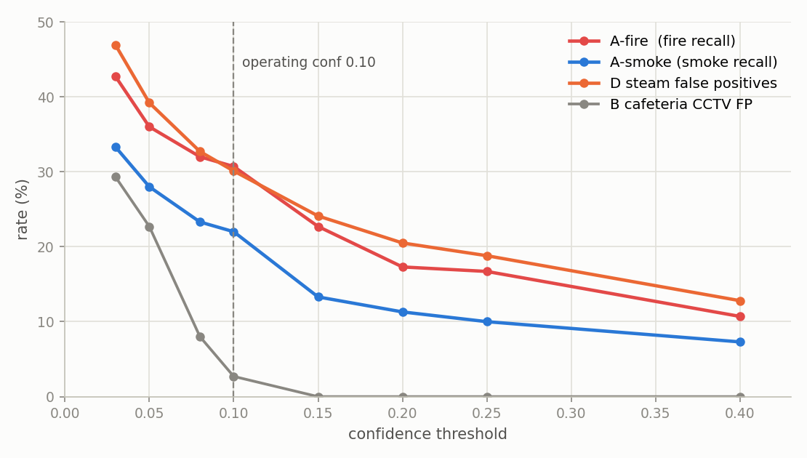
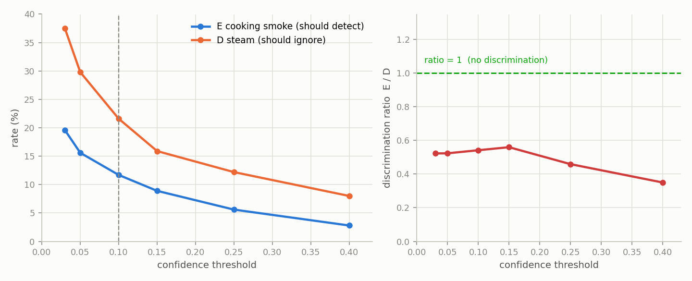
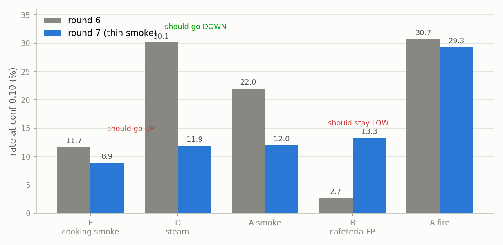
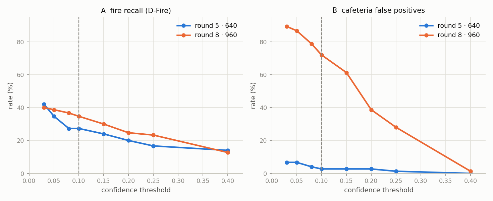

# 회차별 상세 기록

메인 README의 요약을 뒷받침하는 원자료. 회차마다 무엇을 바꿨고 무엇이 변했는지,
그리고 그 변화에서 무엇을 결론지었는지를 순서대로 기록함.

**모델·에폭·입력 크기는 전 회차 동일** (YOLOv8s / 60 epoch / 640px / T4).
바뀐 것은 학습 데이터 구성뿐.

---

## 회차별 A/B/C 전체 수치

학습 데이터 구성만 바꿔 5회 재학습. 모델·에폭·입력 크기는 전 회차 동일 (YOLOv8s / 60 epoch / 640px / T4).

| 회차 | 데이터 변경점 | A 실화재 | B 주방 오탐 | C 배경 오탐 | 판별비 A/B |
|---|---|---|---|---|---|
| 1 | positive 910 / negative 70 | 60.7% | 88.0% | 5.3% | 0.69 |
| 2 | negative 1,031 (주황 물체 크롭) | 12.7% | 49.3% | 4.0% | 0.26 |
| 3 | negative 236 (주방 5곳→8곳, 크롭 제거) | 24.0% | 28.0% | 2.7% | 0.86 |
| 4 | + 주방 밖 배경 600쌍 | 24.0% | 9.3% | 1.3% | 2.58 |
| **5** | **+ positive 50%에 대기 산란** | **22.7%** | **1.3%** | **1.3%** | **17.5** |
| 6 | + smoke 클래스 (연기 소재 197종) | 16.7% | 0.0% | 0.0% | — |
| 7 | 연기 크기·농도를 조리 규모로 재조정 | 21.3% | 2.7% | 1.3% | — |

*conf 0.25 기준 · A·B·C 전부 실제 사진으로만 측정*
*6회차는 클래스가 둘이라 이 표만으로 비교 불가 — 아래 6회차 절에 다섯 지표를 따로 실음*

### 주방 오탐 88.0% → 1.3% (−86.7%p) · 판별비 0.69 → 17.5 (25배)

오탐만 줄이는 건 성과가 아님 — 모델을 조용하게 만들면 되므로. 2회차가 그 함정. 오탐 88%→49%였지만 인식률 60.7%→12.7% 붕괴로 판별비는 악화. **두 지표를 항상 함께 봄.**

---

---

## 1~5회차 — 화염 단일 클래스

**1회차 — 전이는 확인, 배치는 불가**
A 60.7% / C 5.3%로 합성→실사 전이 확인. 동시에 정상 조리 88%에서 오탐.
오탐 위치를 시각화하니 기름이나 튀긴 음식이 아니라 **장비의 주황색 손잡이와 제어판 표시등**. 학습 negative가 급식실 5곳 70장뿐이라 개원중 주방의 그 물체를 본 적이 없었음.

**2회차 — 실패**
주황 물체를 크롭해 hard negative로 명시 학습 → A 12.7% 붕괴, B는 49.3%에 정체.
확대한 주황 크롭을 "불 아님"으로 가르치며 흐릿한 실제 화염까지 억눌림. 한 회차에 5가지를 동시에 바꿔 원인 특정도 불가.

**3회차 — 원인 특정**
1회차 설정 복귀 + **negative만 70→236장(급식실 5곳→8곳)** 변경 → B 88%→28%.
변수 하나만 바꿔 **negative 다양성이 오탐을 지배**함을 확인.

**4회차 — 배경 다양성 가설 기각**
주방 밖 배경 600장에도 동일 화염 합성 + 같은 배경의 "불 없음" 짝을 negative로 투입 → B 28%→9.3%.
A 천장은 46.7%→44.0%로 무변동 → 배경 다양성이 A를 올린다는 가설은 기각.

**5회차 — A 가설 재기각, 판별력 최대 개선**
positive 절반에 대기 산란(채도↓ + 흰 베일 + 투과 + 블러) 적용. 평가셋 실화재가 연기에 섞이거나 대낮에 흐려진 화염이라는 관찰에서 나온 조치.
A 천장 44.0%→42.0%로 무변동 → **후처리로 흐릿함을 흉내내도 못 잡던 화재는 못 잡음.**
대신 B 29.3%→6.7% (conf 0.03). 채도 낮은 화염을 학습하며 모델이 "채도 높은 주황색"이라는 얕은 단서를 쓸 수 없게 되고, 불꽃의 구조·질감으로 판단하게 된 것으로 해석. 의도(A)는 빗나갔으나 5회 중 판별력 개선폭 최대.

---

---

## 같은 인식률에서의 오탐 비교

기준선을 바꾸면 두 지표가 함께 움직임 → 한 지점의 수치로는 모델 비교 불가.
기준선을 훑으며 두 지표를 함께 표시. **왼쪽 위일수록 좋은 모델.**

- 4회차 — 오탐 9.3%에서 인식률 24.0%
- **5회차 — 오탐 6.7%에서 인식률 42.0%** (더 낮은 오탐에서 1.75배)

---

---

## 신뢰도 기준선별 성능 (5회차)

| conf | A 실화재 | B 주방 오탐 | C 배경 오탐 |
|---|---|---|---|
| 0.03 | 42.0% | 6.7% | 5.3% |
| 0.05 | 42.0% | 6.7% | 5.3% |
| **0.10** | **36.0%** | **2.7%** | **4.0%** |
| 0.15 | 30.0% | 2.7% | 2.7% |
| 0.20 | 26.7% | 2.7% | 1.3% |
| 0.25 | 22.7% | 1.3% | 1.3% |

**운용 기준선 = 0.10.** B가 0.10~0.20에서 2.7%로 평평 → 그 구간 시작점이 오탐 최소 상태의 최고 인식률.
인식률 우선 시 0.05 (A 42.0% / B 6.7%)도 선택 가능.

---

---

## 6회차 — smoke 클래스 추가

1~5회차 모델은 fire 하나만 학습함. 제안서의 핵심 서사가 기름넘침·과열의 **조기 대응**인데
불이 붙은 뒤에만 반응하므로 그 서사를 받치는 수치가 없었음. 소재만 연기로 바꿔 같은
파이프라인이 다시 성립하는지도 함께 확인 대상 — 성립하면 증명되는 것은 화염이 아니라
**방법 자체**가 됨.

판정 기준은 학습 전에 확정함 (`web3d/PREREGISTER_SMOKE.md`).

### 재료

연기 소재는 스톡 영상 19개에서 프레임 637장을 뽑아 **자동 게이트**로 거름. 사람이 영상을
고르지 않음. 테두리 휘도로 검은 배경 판정 → 피복률 3~60% → 채도 상한(컬러 스모크 배제)
→ 밀도·구조(빈 프레임·균질 안개층 배제) → 지각해시 중복 제거.
**637장 중 219장이 배경 게이트에서 탈락**함. 배경이 회색·하늘인 클립은 알파를 뽑을 수 없음.
최종 **197종**.

연기 합성에는 화염에 없던 처리 둘을 넣음.

- **배경 적응 틴트** — 배경이 밝으면 검댕 연기 쪽으로 기움. 흰 연기는 흰 급식실에서
  보이지 않아 라벨만 남고 신호가 없는 학습 예제가 됨.
- **가시성 검사** — 합성 후 박스 영역의 화면 변화량을 재서 **보이지 않는 연기는 장면째 버림.**
  합성이므로 정답을 알고 있어 가능한 검사.

화염 positive 총량은 5회차와 같게 맞춤(베이스당 13→20회). 화염 성능 변화를
"클래스 추가의 효과"와 "데이터 양 변화"로부터 분리하기 위함임.

### 평가군 3개 → 5개

| 그룹 | 구성 | 답하는 질문 |
|---|---|---|
| A-fire | D-Fire 실화재 150장 | 화염 전이 (5회차와 동일 이미지) |
| **A-smoke** | **D-Fire 실연기 150장** | **연기 전이 — 실제 연기 0장 학습** |
| B | 급식실 CCTV 75장 | 배치 환경 오탐 |
| C | D-Fire 배경 75장 | 도메인 암기 |
| **D** | **수증기 352장 (스톡 24개 영상)** | **김을 연기로 오인하는가** |

D는 이번 회차 신설. 급식실은 국솥·찜기로 김이 상시 발생하고, 연기와 수증기는 회색 반투명이라
물리적으로 구별이 어려움. 시작 전에 **최대 위험**으로 지목하고 평가군을 따로 만듦.

### 결과 — 부분 성립 · 수증기 오탐 초과

| 지표 | 값 | 95% 신뢰구간 | 사전 등록 기준 |
|---|---|---|---|
| A-fire 화염 인식 | 30.7% (46/150) | 23.8~38.5 | 5회차 대비 −8%p 초과 시 회귀 |
| **A-smoke 연기 인식** | **22.0% (33/150)** | 16.1~29.3 | ≥40% 성립 / 20~40% **부분** |
| B 급식실 오탐 | 2.7% | 0.7~9.2 | ≤15% |
| C 배경 오탐 | 1.3% | — | — |
| **D 수증기 오탐** | **30.1% (106/352)** | 25.6~35.1 | **≤25% — 초과** |
| **E 조리 연기 인식** | **11.7% (21/179)** | 7.8~17.3 | 사후 신설 평가군 |
| **판별비 E/D** | **0.54** | — | **1 미만 = 구별 실패** |

*운용 기준선 conf 0.10*

**화염은 망가지지 않음.** 5회차 27.3% → 6회차 30.7%. 다만 두 비율 차이 검정 z=0.64로
유의차가 아니므로 "개선"이 아니라 **"클래스를 하나 더 넣어도 화염이 나빠지지 않음"**이
정확한 결론. 2회차에서 hard negative를 넣었다가 화염이 60.7%→12.7%로 붕괴한 전례가
있어 회귀 여부를 사전 등록 항목으로 둔 것인데, 여유 있게 통과함.

**연기는 절반쯤 배움.** 22.0%로 부분 성립. 다만 이 수치가 무엇을 재는지 정확히 해야 함.
정탐 사례가 전부 산불·선박화재·건물화재의 **큰 회색 기둥**임. 급식실 튀김솥 규모의
옅은 연기는 한 장도 없음.

**따라서 22.0%는 "주방 연기를 22% 잡는다"는 뜻이 아님.** "합성 연기로만 학습했는데 실제 연기
픽셀에 반응하는가"라는 더 좁은 질문의 답이며, 전이 여부의 증거이지 배치 성능의 근거가 아님.

이 격차는 화염보다 연기에서 더 큼. 불은 규모가 달라도 픽셀이 비슷하다 — 촛불이든 산불이든
주황색이고 밝고 구조가 있음. 연기는 규모와 배경에 따라 다른 물체가 됨. 산 능선을 배경으로 한
거대한 회색 기둥과, 흰 급식실 벽 앞에서 튀김솥 위로 가늘게 오르는 옅은 연기는 사실상 별개.
소재 편중도 같은 방향으로 작용한다 — 197종 중 110종이 영상 3개에서 나왔고 대체로 굵은 연기였음.

**수증기가 30.1%로 상한을 넘김.** 시작 전 지목한 최대 위험이 그대로 실현됨.
숫자를 쪼개면 두 갈래. smoke 클래스가 21.6%, 나머지 8.5%는 **fire 클래스가 수증기 사진에서
울린 것**으로, 나무 찜기의 노란 조명과 주황색 열등이 원인임.
**1회차의 주황색 물체 오탐이 급식실 밖 주방에서 재현됨.** 급식실 CCTV에서 2.7%인 것은
그 환경의 주황색 물체를 학습 negative로 봤기 때문이지 문제가 사라진 것이 아님.

임계값 조정으로는 풀리지 않음. conf 0.40에서도 수증기 12.8%인데 그때 연기 인식률은
7.3%로 무너짐.

**다만 30.1%를 급식실 오탐률로 읽으면 안 됨.** D는 김을 주인공으로 찍은 스톡 클로즈업이라
의도적으로 어려운 조건임. 실제 급식실은 카메라가 멀고 김이 화면에서 작음.
참값은 급식실 CCTV의 2.7%와 30.1% 사이에 있으며, 그 구간을 좁히려면 **급식실에서 김이 오르는
장면**을 따로 확보해야 함.

### 조리 연기 평가군(E) — 판별비 0.54

A-smoke가 산불·건물화재뿐이라 배치 성능을 말하지 못한다는 문제를 풀기 위해,
**조리 연기 평가군 E**를 따로 만듦. 스톡 영상 24개 → 자동 검사(불꽃 화소·워터마크·
수증기 혼입 배제) → **179장 / 영상 14개**. 그릴·철판 93장, 스토브(팬·웍·냄비) 86장으로
유형을 반반 맞춤. 학습 미사용.

이로써 "잡아야 할 연기(E)"와 "무시해야 할 김(D)"이 짝을 이뤄, 화염에서 쓰던 **판별비**를
연기에도 적용할 수 있게 됨.

| conf | E 조리 연기 인식 | D 수증기 오탐 | 판별비 E/D |
|---|---|---|---|
| 0.03 | 19.6% | 37.5% | 0.52 |
| **0.10** | **11.7%** | **21.6%** | **0.54** |
| 0.25 | 5.6% | 12.2% | 0.46 |
| 0.40 | 2.8% | 8.0% | 0.35 |

**판별비가 1을 넘지 못함.** 모델이 조리 연기보다 수증기에 더 자주 반응한다는 뜻임.
임계값을 0.03에서 0.40까지 훑어도 0.35~0.56 구간을 벗어나지 않음.
5회차 화염 판별비가 17.5였던 것과 대비된다 — **화염은 불과 정상 조리를 구별하지만,
연기는 연기와 김을 구별하지 못함.**

영상 단위로 보면 더 분명함. 정탐 21장이 영상 3개에 몰려 있고 **14개 중 10개가 0%**임.

| 반응한 영상 | 인식률 | 특징 |
|---|---|---|
| cooksmoke07 | 84.6% (11/13) | 흑백·검은 배경, 굵고 진한 연기 기둥 |
| cooksmoke24 | 57.1% (4/7) | 실외 웍, 대비 강한 연기 |
| cooksmoke19 | 33.3% (5/15) | 업소용 웍, 회색 기둥 |
| 나머지 10개 | 0.0% | 얇거나 옅거나 배경과 밝기가 비슷 |

그릴 12.9% vs 스토브 10.5%로 조리 형태별 차이는 없음. 원인이 조리 유형이 아니라는 뜻임.

**진단: smoke 클래스가 배운 것은 "조리 연기"가 아니라 "크고 진한 회색 덩어리"다.**
합성 연기의 폭이 조리기구 대비 0.45~1.25배인 굵은 기둥이었고, 실제 조리 연기는 실처럼
얇게 오름. 학습에서 본 적 없는 형태. 반대로 수증기 평가군은 김을 클로즈업한 진한
덩어리이며 합성 연기와 오히려 닮음. 판별비가 뒤집힌 이유가 여기에 있음.

**따라서 처방 순서가 바뀜.** 당초 계획은 "수증기를 학습 negative로 투입"이었으나,
positive가 대상을 대표하지 못하는 상태에서 negative를 넣으면 2회차(주황 물체 hard negative로
정탐 붕괴)를 반복함. 7회차의 단일 변수는 **연기 합성의 크기·농도 분포를 조리 규모로
재조정**하는 것이며, 수증기 negative는 그 다음임.

**단일 프레임 접근의 한계 가능성도 열어둠.** 김과 연기는 둘 다 회색 반투명 부유물이며
정지 이미지 한 장으로는 사람도 구별이 어려움. 결정적 단서는 시간에 있다 — 끓는 김은
일정하게 유지되나 과열 연기는 점점 짙어지고 어두워짐. 7회차에도 판별비가 1을 넘지
못하면 단일 프레임 한계로 보고 다중 프레임 설계로 전환해야 함.

### 이 회차는 진단이며 처방이 아니다

처방은 명확하나 이번 회차에서 실행할 수 없음. 수증기를 학습 negative로 명시적으로 가르치는
것이 정공법인데, 보유한 352장은 평가셋이라 학습에 쓰는 순간 평가가 무의미해짐.
수증기 영상을 새로 확보해 학습용과 평가용을 분리해야 함.

수증기 오탐과 연기 인식률은 처방이 서로 다르고 **서로 반대 방향으로 당김.** 수증기를
negative로 넣으면 연기 인식률이 더 떨어질 가능성이 높다(2회차와 같은 구조). 따라서 한 회차에
하나씩만 바꿈.

그리고 그 전에 **조리 연기 평가군(E)**이 필요함. 지금은 "무시해야 할 것"(수증기)의 평가군만
있고 "잡아야 할 것"(조리 연기)의 평가군이 없어 절반짜리 측정임. 과열된 기름·팬에서 연기가
나는 스톡 영상은 수증기와 같은 방식으로 확보 가능하며, 둘이 갖춰지면 **조리 연기와 수증기를
구별하는 능력**을 판별비로 직접 잴 수 있음. 화염에서 A/B 판별비를 쓴 것과 같은 구조.

---

---

## 7회차 — 연기 positive를 조리 규모로 재조정 (실패)

6회차 진단: smoke 클래스가 배운 것은 조리 연기가 아니라 "크고 진한 회색 덩어리".
가설은 **positive 분포가 대상을 대표하지 못해 판별비가 뒤집혔다**는 것.
판정 기준은 학습 전에 확정함 (`web3d/PREREGISTER_R7.md`).

### 바꾼 것

- 합성 연기 폭을 조리기구 대비 0.45~1.25배 → **0.25~0.80배**, 세로 신장 확대
- 경계 블러 축소(0.2~1.0) — 실 구조 보존
- 소재 추출의 밀도 게이트 완화 → **197종 → 248종** (가는 연기 영상 smoke12 3→23, smoke15 0→11)
- 이 형태를 연기 장면의 70%에 적용
- 불투명도·가시성 검사·수증기 negative는 손대지 않음

화염 positive 총량은 6회차와 동일(박스 1,262개). 수증기 negative는 넣지 않음 —
positive가 대상을 대표하지 못하는 상태에서 hard negative를 넣으면 2회차를 반복함.

### 결과 — 판별비는 올랐으나 분모가 줄어서 오름

| 지표 | 6회차 | 7회차 | z | 유의 |
|---|---|---|---|---|
| **E 조리 연기 인식** | 11.7% | **8.9%** | −0.87 | − |
| **D 수증기 오탐** | 30.1% | **11.9%** | −5.92 | **O** |
| **판별비 E/D** | 0.54 | **0.75** | — | 미달 |
| A-smoke | 22.0% | 12.0% | −2.31 | **O** |
| **B 급식실 오탐** | 2.7% | **13.3%** | +2.41 | **O** |
| C 배경 오탐 | 1.3% | 5.3% | +1.36 | − |
| A-fire | 30.7% | 29.3% | −0.25 | − |

*운용 기준선 conf 0.10 · 두 비율 차이 검정*

**판별비 0.54 → 0.75는 개선이 아님.** 올라야 할 E는 11.7%→8.9%로 내려갔고,
내려야 할 D가 30.1%→11.9%로 더 크게 내려가 비율만 좋아짐.
**모델이 연기를 더 잘 잡게 된 것이 아니라 전반적으로 조용해졌고, 그 조용해짐이 김 쪽에서
더 크게 나타난 것.** 이 저장소 첫머리에 적어둔 원칙에 정확히 걸림 — "오탐만 줄이는 건
성과가 아님. 모델을 조용하게 만들면 되므로."

**배치 환경 오탐은 오히려 악화.** 급식실 CCTV 오탐이 2.7%→13.3%로 다섯 배,
통계적으로도 유의함. 설명은 가능함 — 모델의 "연기" 개념을 진한 덩어리에서 얇은 실로
옮겼으므로, 클로즈업된 진한 김에는 덜 반응하고 급식실에 흔한 **멀고 옅은 김에는 더**
반응하게 됨. **오탐이 사라진 것이 아니라 자리를 옮김.**

**합성 검증과 실사 전이의 격차.** 학습 로그 기준 합성 검증셋에서 smoke mAP50 = **0.939**.
합성 연기는 거의 완벽하게 학습했으나 실사 조리 연기는 8.9%. 화염은 이 격차가 작았으나
연기는 압도적임. 합성 성능이 전이를 보장하지 않는다는 가장 선명한 사례.

화염은 두 회차 연속 회귀 없음(30.7% → 29.3%, z=−0.25).

### 판정 — 연기 조기 경보는 이번 PoC 범위에서 종결

사전 등록에 명시한 대로, **판별비 1 미달이므로 단일 프레임 접근의 한계로 판단**함.
근거 셋.

1. 두 회차의 **서로 다른 처방**(6회차 클래스 추가, 7회차 positive 분포 교정)이 모두 1을 못 넘김
2. 실패 방식이 일관됨 — 오탐을 줄이면 정탐도 같이 줄고, 오탐은 사라지지 않고 자리를 옮김
3. 김과 연기는 정지 화면에서 같은 물체(회색 반투명 부유물). 구별 단서는 **시간 변화**에
   있을 가능성이 높음 — 끓는 김은 일정하게 유지되나 과열 연기는 점점 짙어지고 어두워짐

다중 프레임 설계는 모델 구조가 바뀌는 일이므로 본 PoC 범위를 넘음. **미해결 과제로 명시**하고,
화염 탐지 라인으로 복귀함.

**제안서 서술** — 화염 탐지(판별비 17.5 · 웹3D 절차적 화염 전이 성립 · IoU 관문 통과)를
주장으로 세우고, 연기 조기 경보는 "두 회차의 통제 실험으로 한계를 규명했으며 다중 프레임이
다음 방향"으로 기술함. 두 기능을 같은 성숙도로 서술하지 않음.

---

---

## 8회차 — 입력 해상도 640 → 960 (기각)

1~7회차는 **학습 데이터 구성만** 바꿨음. 모델 크기·입력 해상도·추론 방식은 전 회차 고정.
그중 해상도를 처음으로 건드린 회차. 가설은 "A 42~44% 천장이 작은 화염을 못 보기 때문"이며,
미탐 사례에 멀고 작은 화염이 다수였던 관찰에서 나옴.
판정 기준은 학습 전 확정 (`PREREGISTER_R8.md`).

**변수 하나: `imgsz` 640 → 960.** 데이터 구성·모델·에폭·배치 모두 5회차와 동일.

### 결과 — A는 올랐으나 B가 폭증

| 지표 | 5회차 (640) | 8회차 (960) | z | 판정 |
|---|---|---|---|---|
| A 실화재 인식 | 27.3% | **34.7%** | 1.37 | 채택선(+5%p) 통과, 유의차는 아님 |
| **B 급식실 오탐** | **2.7%** | **72.0%** | **8.78** | **기각 조건 초과 (허용 +3%p)** |
| C 배경 오탐 | 4.0% | 1.3% | −1.01 | — |
| **판별비 A/B** | **10.25** | **0.48** | — | 1회차(0.69)보다도 낮음 |
| 추론 속도 | 13.9 ms | 17.2 ms | — | 58 FPS, 실시간 문제없음 |

**임계값 조정으로 살릴 수 없음.** 8회차가 5회차의 A 27.3% / B 2.7%를 동시에 이기는 지점이
conf 전 구간에 존재하지 않음. conf 0.40에서 B가 1.3%로 내려가나 그때 A는 12.7%로
5회차 14.0%보다 낮음. **완전히 지배당함.**

### 숫자가 아니라 사진이 판정을 뒤집음

미탐 사례 비교 셀을 넣어둔 것이 결정적이었음. **5회차가 놓치고 8회차가 새로 잡은 30장이
전부 산불·건물화재의 거대한 불기둥**이었고, 가설이 예측한 "작고 먼 화염"은 한 장도 없었음.

즉 8회차 모델은 **더 잘 보게 된 것이 아니라 더 잘 울게 됨.** 판단 기준이 전반적으로
느슨해져 놓치던 큰 불도 잡고, 동시에 급식실의 스테인리스 반사·김·노란 기름에도 반응함.
A 상승과 B 폭증이 같은 원인.

7회차와 정확히 거울상임. 7회차는 전반적으로 조용해져 판별비가 올랐으나 정탐도 함께 하락했고,
8회차는 전반적으로 시끄러워져 A가 올랐으나 오탐이 폭증. **둘 다 판별력 개선이 아니라
감도 이동.** 숫자만 봤다면 8회차를 "부분 성공"으로 잘못 읽었을 것.

### 이 회차의 가장 큰 한계 — 평가셋이 주방 화재가 아님

**8회차가 새로 잡은 30장은 전부 산불·건물화재·차량화재이며 주방 화재가 아님.**
평가 A(D-Fire 150장)가 애초에 그런 사진으로 채워져 있기 때문. 선별 규칙으로 실내 근접
화재를 걸렀으나 D-Fire 자체에 그런 이미지가 희소함.

따라서 **A 27.3%든 34.7%든 급식실 화재 탐지율을 뜻하지 않음.** 이번 판정을 A 상승이 아니라
B 폭증으로 내린 이유가 여기에 있음 — B는 실제 급식실 CCTV라 신뢰할 수 있는 신호.

주방 화재 공개 데이터가 희소한 이유는 학습 데이터가 없는 이유와 같음. 산불·건물화재는
뉴스와 훈련 영상으로 쌓이나, 주방 화재는 발생 순간이 촬영되는 경우가 드물고 CCTV에 잡혀도
사고 기록이라 공개되지 않음. **급식실에 불을 낼 수 없어 합성으로 학습한 제약이 평가에도
그대로 걸려 있음.**

### 남은 결론

- **42~44% 천장은 해상도 문제가 아님.** 남은 후보는 3·4·5회차에서 반복 확인된 화염 소재 다양성.
- 배치 후보 가중치는 **5회차 그대로**. 8회차는 기각 기록으로 보존.
- 이후 실험의 **주 지표를 A에서 판별비 A/B로 변경.** 이번에는 B 게이트가 작동해 걸러냈으나,
  감도 이동을 성능 개선으로 오독하지 않으려면 판별비를 주 지표로 두는 것이 맞음.

---

## 평가군 F 신설 — 주방 화재 전용 평가셋 (회차 아님)

8회차 이후, 회차가 아니라 **평가 설계**를 바꿈. 상세는 [평가군 F 사전 등록](PREREGISTER_F.md).

8회차에서 A(D-Fire)로는 이 프로젝트의 목표를 측정할 수 없음이 확정됨 — 해상도를 올리자
A가 27.3%에서 34.7%로 올랐으나 새로 잡은 30장이 전부 산불·건물화재였고 급식실 오탐은
2.7%에서 72.0%로 폭증함.

실제 주방 화재 사고 영상은 공개된 것이 사실상 없음. 대신 **소방 기관의 화재 재현 실험
영상 7개**에서 화염 264장과 화염없음 91장을 뽑음. 사고가 아니라 실험이지만 조리기구
위에서 타는 식용유 화염이라는 물리 현상은 동일함.

화염없음 91장은 **같은 실험·같은 배경에서 불만 없는 장면**임. 모델이 배경에 반응하는지
화염에 반응하는지 직접 갈라냄. 기존 평가군 C(D-Fire 배경)는 배경 자체가 달라 이 구분을
하지 못했음.

주 지표는 **출처별 인식률의 macro 평균**. kfire01이 264장 중 127장을 차지하나 연속 구간
네 덩어리에서 나온 것이라 독립 관측이 아니므로, 장수 합산은 이 출처에 과도한 발언권을 줌.

### 첫 채점 결과 (5회차 가중치, conf 0.10)

| 지표 | 값 |
|---|---|
| F 인식률 (macro) | **42.3%** |
| F 오탐률 (macro) | **10.9%** |
| 판별비 F | **3.86** |
| micro 인식률 | 40.9% (108/264) |
| micro 오탐률 | 11.0% (10/91) |

macro와 micro가 1.4%p 차이이므로 특정 출처가 전체를 끌고 있지는 않음.

### 크기가 아니라 색에서 갈림

| 화염 면적비 | 인식률 |
|---|---|
| 0~2% | 28.6% (20/70) |
| 2~5% | 40.9% (9/22) |
| 5~15% | 39.7% (25/63) |
| 15~100% | 49.5% (54/109) |

처음 세운 가설은 "작아서 못 잡는다"였으나 **가장 큰 구간조차 49.5%** 임. 놓친 사진 다수가
화면 절반을 채우는 불기둥이었음.

놓친 화염의 공통점은 크기가 아니라 **하얗게 날아간 색과 밝은 배경**임. 잡은 것은 주황빛이
뚜렷하고 배경이 어두움. 실제로 타는 식용유는 온도가 높아 흰빛에 가깝고 카메라를 포화시키는데,
**합성에 쓰는 화염 소재는 어두운 배경 위의 주황색 불꽃뿐이며 1회차 이후 한 번도 바뀌지 않았음.**
학습이 본 적 없는 외형이므로 무반응이 설명됨 → 9회차 변수.

### 오탐 10장의 정체

황동 냄비 4장(가스레인지 위 놋냄비를 화염으로 판단), 수증기 2장(구리 팬에서 오르는 김),
삼각대에 걸린 어두운 물체 1장, 기타 3장. 급식실은 스테인리스 조리기구와 김이 상시로 있으므로
앞의 둘은 반드시 다뤄야 함 → 10회차 이월.

### 로고를 화재로 잡은 오염 사건

첫 채점에서 kfire05의 인식률이 96.4%로 나옴. 다른 출처가 12~54%인데 이 출처만 유독 높아
탐지 이미지를 확인하니, 초록 상자가 냄비가 아니라 **왼쪽 아래 구석의 소방서 엠블럼**에
쳐져 있었음. 빨강·주황의 방패 모양 크레스트임.

문제는 오탐만 부풀린 것이 아님. 채점 방식이 "화면 어딘가에 fire 상자가 있으면 인식"이므로
**인식률까지 통째로 거짓이 됨.** 로고 영역(하단 22%)을 잘라내고 재채점하니 21.4%였고,
28장 중 21장이 허위 정탐이었음. 주 지표 macro 인식률도 53.0%에서 42.3%로, macro 오탐률은
27.6%에서 10.9%로 바뀜.

**수치만 보고 판단했다면 F의 첫 측정이 통째로 거짓이 될 뻔했음.** 8회차에서도 미탐 사진을
보고 판정이 뒤집혔음. 두 회차 연속으로 이미지 확인이 결론을 바꿨음.

### 사전 등록의 결함도 함께 기록

macro 오탐률 계산에서 kfire05는 화염없음이 2장뿐인데 다른 출처와 동등한 1/7 발언권을 가짐.
첫 채점에서 2/2 = 100%가 macro 오탐률 27.6%를 만들었음. 표본 2장짜리 비율을 동등하게
평균한 것은 설계 실수임. 다음부터는 **화염없음 10장 이상인 출처만 macro 오탐률에 포함**하는
조건을 사전에 둠.
