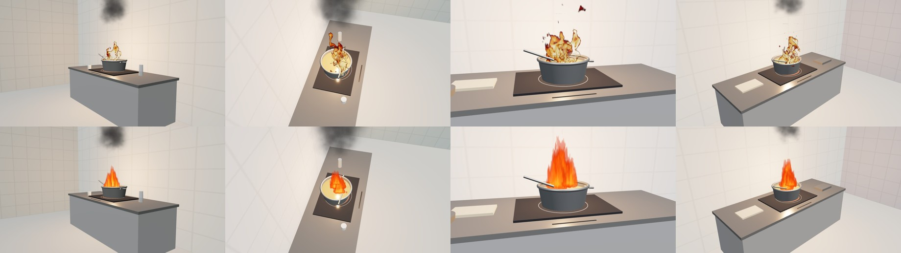
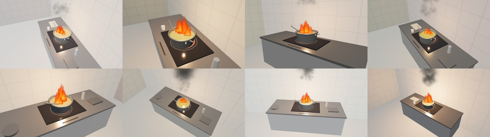
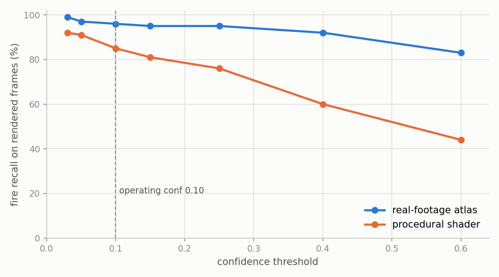
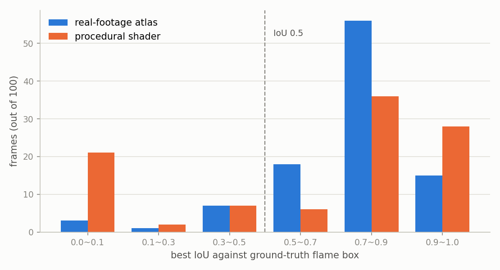

# 웹3D 렌더 도메인 전이 테스트 — 상세

메인 README의 요약을 뒷받침하는 원자료.

---

## 개요

배치 최종 단계는 웹3D 로봇이 화구를 차단하는 것. 그 전에 **렌더 화면에서 화재가 탐지되는지** 확인 필요.
인덕션 조리대 위 튀김 냄비를 three.js로 구성, 정상 조리 · 과열/연기 · 발화 3단계를 재현.

*위: 실사 화염 아틀라스 / 아래: 절차적 셰이더 화염. 같은 열은 씬 파라미터와 카메라 자세가 완전히 동일 — 고정 시드(mulberry32, 20260804)로 두 조건이 같은 순서를 밟음.*

### 왜 두 조건인가

1차 테스트에서 발화 40장 중 37장(92.5%)이 탐지됐으나 두 약점이 남음.
표본 64장에 씬 1종 고정(신뢰구간 80.1~97.4%, 폭 17.3p), 그리고 **렌더에 쓴 화염 아틀라스가 학습에 포함된 실사 영상 v03에서 추출**된 것.
즉 모델에게 초면인 픽셀이 아니었음. "같은 화염 텍스처, 다른 배경"의 전이이지 sim2real이 아님.

보완으로 화염을 **FBM 노이즈 + 도메인 워핑으로 GLSL에서 생성**하는 경로를 추가. 색은 텍스처 없이 밀도·높이에서 온도를 산출해 계산. **실사 픽셀 0장.**
변수는 화염 생성 경로 하나뿐 — 배경·조명·카메라·냄비·잡기물은 두 조건에서 동일.

씬 자체도 캡처마다 랜덤화: 벽 타일 밝기·색조, 상판 명도, 냄비 크기(0.86~1.16배)와 재질(스테인리스 / 어두운 아노다이즈), 기름 색, 조명 색온도, 잡기물 5종 노출.

*절차적 화염 캡처 일부. 장수만 늘리면 실질 표본은 씬 1종에 머물므로 씬 파라미터를 함께 흔듦.*

### 결과

| 조건 | 화염 생성 경로 | 발화 D | 95% 신뢰구간 | 정상 오탐 E |
|---|---|---|---|---|
| 1차 (씬 고정) | 실사 아틀라스 | 92.5% (37/40) | 80.1~97.4 | 0.0% (0/12) |
| A | 실사 아틀라스 | 96.0% (96/100) | 90.2~98.4 | 0.0% (0/30) |
| **P** | **절차적 셰이더** | **85.0% (85/100)** | **76.7~90.7** | **0.0% (0/30)** |

*운용 기준선 conf 0.10 · 조건 A와 P는 같은 씬·같은 구도의 짝지은 표본*

**사전 등록 판정: 전이 성립** (`web3d/PREREGISTER.md`, 캡처 전 확정)
기준은 D ≥ 50% 전이 성립 / 25~50% 부분 전이 / < 25% 실사 텍스처 의존.
조건 P는 신뢰구간 하한(76.7%)조차 통과선의 1.5배 — 표본 요동으로 설명 불가.

**텍스처 계열이 기여한 몫: 11.0p** (96.0% → 85.0%)
실사 픽셀을 완전히 걷어내도 85%가 남지만, 성능의 일부는 여전히 화염 텍스처 계열이 떠받침.

기준선을 올리면 두 조건이 갈라짐 — conf 0.60에서 아틀라스 83% vs 절차적 44%.
**절차적 화염에 대해 모델의 확신이 낮음.** 운용 임계값을 0.10~0.15로 유지해야 하는 근거이자, 학습셋에 절차적 화염을 섞어야 한다는 다음 과제.

### 박스 위치 정확도 (IoU)

위 D는 이미지 단위 — "신뢰도 0.10 이상 박스가 하나라도 있는가"만 판정하며 위치를 보지 않음.
파이프라인 5~9단계는 탐지 좌표를 VLM과 안전 규칙에 넘기므로, **좌표가 쓸 만한지 별도 확인 필요.**

정답 박스는 씬에서 화염 오브젝트만 남기고 검은 배경으로 한 번 더 렌더한 뒤 밝은 화소의 외접
사각형으로 자동 생성. 발화 200장(조건 A·P 각 100) 전부에서 추출 성공, **수작업 라벨링 0건.**

| 조건 | 이미지 단위 D | IoU 0.5 기준 D | 유지율 | 정탐 평균 IoU |
|---|---|---|---|---|
| A 실사 아틀라스 | 97.0% | 89.0% | 91.8% | 0.788 |
| **P 절차적 셰이더** | **81.0%** | **70.0%** | **86.4%** | **0.851** |

**사전 등록 판정: 좌표 사용 가능** (유지율 ≥ 0.80 → 5단계 진행)

두 조건 모두 분포가 0.7~1.0에 몰림. 조건 P의 0.0~0.1 구간 21건 중 19건은 **미탐**이며
위치 오류가 아님. 즉 **탐지에 성공하면 위치는 대체로 정확**하고, 위치만 어긋난 사례는
탐지 81건 중 11건(13.6%).

조건 P의 정탐 평균 IoU가 조건 A보다 높음(0.851 vs 0.788). 실사 아틀라스는 본체에서 떨어져
나온 불티가 정답 박스를 부풀리는 반면 절차적 화염은 덩어리가 하나로 뭉쳐 있기 때문으로 해석.

같은 시드로 재캡처했으나 조건 P 이미지 단위 D가 85.0%→81.0%로 이동. 정답 박스 추출을 위해
프레임당 렌더를 한 번 더 하면서 화염 애니메이션 위상이 달라진 결과.
**재실행 변동폭 약 4p**로 기록하며, 이 규모 이하의 차이는 유의미하게 해석하지 않음.

### 해석 규칙

세 수치를 모두 공개하며 조건 P만 떼어 인용하지 않음. 1차 92.5%와 조건 A 96.0%의 차이는 표본 2.5배 증가와 검은 공백 제거가 동시에 일어난 결과로, 통제된 비교가 아니므로 인과로 서술하지 않음.

**"3D로 생성한 화염도 인식"까지가 이 실험이 지지하는 문장.** "실제 주방 화재를 잡는다"는 별개 주장이며 실제 주방 화재 평가셋이 필요.

웹3D 성능을 인용할 때는 이미지 단위 D와 IoU 기준 D를 항상 함께 적음.

---

